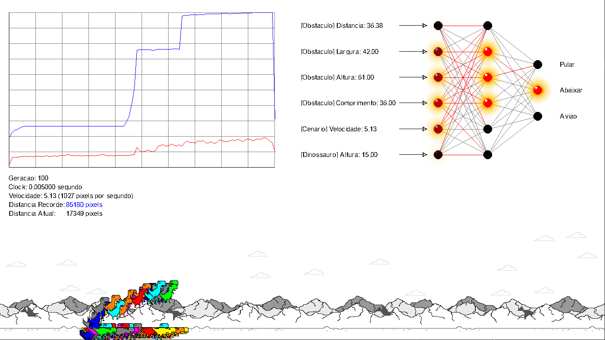

# Neural Network in Dino Chrome Game



## Disclaimer

Este é apenas um fork com as libs necessárias para rodar o código criado pelo João Victor.

## Dependências

- sdl2
- sdl2-ttf
- sdl2-image
- libwebp
- make
- g++ or clang++

Linux

```sh
sudo apt install -y libsdl2-dev libsdl2-ttf-dev libsdl2-image-dev libwebp-dev libgsl-dev
```

## Como instalar?

Abra o repositorio em um terminal e execute:

```
make install
```

## Como executar

```
make run
```

Ao executar, o programa irá criar uma pasta chamada `redes` no qual guarda o progresso e as redes mais avançadas no game.

## Observações

- O arquivo `redeNeural.c` na pasta `src` contém todas as funções relativas a implementação da Rede Neural (tudo sobre a rede neural está nesse arquivo).
  Ele está genérico, ou seja, você pode copiar o arquivo e incluir no seu projeto e você conseguirá usar a rede neural facilmente.
  Exemplo: RedeNeural\* Dino = RNA_CriarRedeNeural(1,2,3,4);
  Nesse exemplo nós estamos criando uma variável chamada 'Dino' que vai receber a Rede Neural que foi alocada dentro da função RNA_CriarRedeNeural()... Não esqueça de destrui-la após usar, utilizando a função RNA_DestruirRedeNeural(Dino);
- A função 'ControlarEstadoDinossauros' dentro do arquivo 'main.cpp' contém o código que faz a comunicação entre o jogo e a rede neural.
- O resto dos arquivos são apenas os códigos da implementação do jogo.

Um grande abraço!

## Créditos

[JVictorDias](https://github.com/JVictorDias)

[Código Original](https://github.com/JVictorDias/Dinossauro-Google)

[Youtube do JVictorDias](https://www.youtube.com/watch?v=NZlIYr1slAk)
